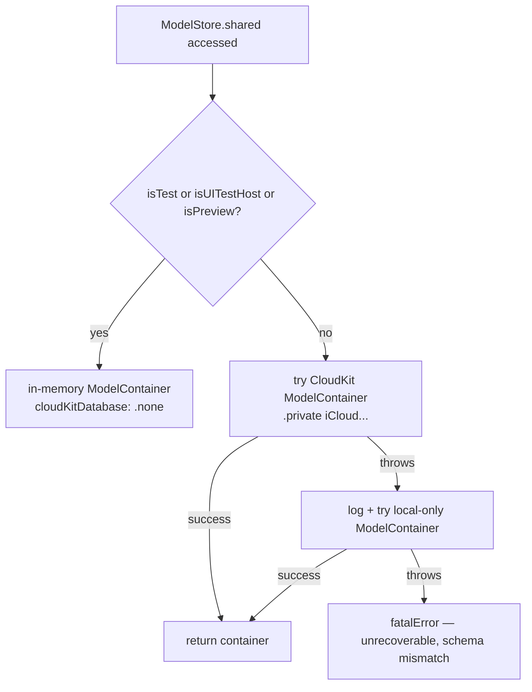

# Design: Phase 1 Foundation

## Overview

Phase 1 lands the data layer (SwiftData + CloudKit), theme system, app shell with two-tab navigation, Trip CRUD, and Person management. After Phase 1 the app is runnable, persists across launches, syncs through the user's iCloud, and presents a recognizable structure — but every per-phase content surface (timeline content, packing, rules engine) is still empty.

## Architecture

### Module layout

Single iOS app target. New folders under `Scramble/Scramble/`:

```
Scramble/Scramble/
├── ScrambleApp.swift             (refactored — replaces template)
├── Models/                       (SwiftData @Model entities + enums + Codable blobs)
├── Persistence/ModelStore.swift  (container factory; env detection)
├── Theme/                        (Theme struct, MidnightAtlas, EnvironmentKey)
├── Features/
│   ├── Root/RootView.swift       (TabView with two tabs)
│   ├── Trips/                    (TripsTab, TripList, TripDetail scaffold, TripEditor, TripStatus)
│   ├── MasterLists/              (placeholder tab)
│   └── People/PersonEditor.swift (inline create from TripEditor)
├── Components/                   (PersonAvatar, PhaseNodeMarker)
└── Util/                         (Calendar/date helpers)
```

The template `Item.swift` is deleted and `ContentView.swift` is replaced by `RootView.swift`. Tests already live in `ScrambleTests/` and `ScrambleUITests/`.

### Composition root

```
ScrambleApp                          (@main App)
  └── WindowGroup
        └── RootView
              ├── .environment(\.theme, .midnightAtlas)
              └── .modelContainer(ModelStore.shared)
```

`ModelStore.shared` is a `static let` evaluated once at first access. Theme is injected at the root via a custom environment key. Both are unconditionally available to every descendant.

### Container resolution flow



Detection mechanism (per Decision 12):

| Context | Signal |
|---|---|
| Unit tests (host app loaded with XCTest) | `ProcessInfo.processInfo.environment["XCTestConfigurationFilePath"] != nil` |
| UI tests (host app, no XCTest in process) | Launch argument `-uitest 1` set on `XCUIApplication.launchArguments` *before* `app.launch()` |
| SwiftUI Previews | `ProcessInfo.processInfo.environment["XCODE_RUNNING_FOR_PREVIEWS"] == "1"` |

The probes accept an injected `EnvironmentProbe` (a small struct wrapping `environment: [String: String]` and `arguments: [String]`); the production default reads `ProcessInfo.processInfo`. This makes the probes unit-testable in isolation — `ProcessInfo.processInfo` itself is read-only and cannot be mocked in-process. `ModelStoreEnvironmentTests` constructs `EnvironmentProbe` instances with synthetic env/arguments and asserts the branch selection. A separate UI-test smoke check (`AppLaunchUITests.testLaunchUsesInMemoryContainer`) asserts the host-app side actually wires up correctly.

UI-test launch convention: every UI test class's `setUp()` constructs a fresh `XCUIApplication`, sets `app.launchArguments = ["-uitest", "1"]`, then calls `app.launch()`. Setting `launchArguments` after `launch()` is a no-op and must be caught in code review.

**CloudKit schema promotion (operational, not code).** The first production deploy (and every subsequent schema change) requires manually promoting the dev-environment CloudKit schema to production via the CloudKit Dashboard. Until promoted, TestFlight/App Store builds will fail to sync silently — and our silent local-fallback in AC 2.3 will mask the failure. Implementation phase: log the fallback at `os_log(.error)` level with a distinctive message so post-deploy inspection of Console.app surfaces it.

### Theme + appearance

`Theme` is a value type holding two `ThemeVariant`s (dark, light) plus a `PersonPalette`. Variant selection is a derived read against `@Environment(\.colorScheme)` — no separate observable. Adding a second theme later means: declare it, expose a picker, set `\.theme` from the picker. Call sites read colors via `theme.dark / theme.light` selected by current `colorScheme`, so no call-site changes are needed.

### Tab bar visibility

`RootView` is a single `TabView`. Trip Detail applies `.toolbar(.hidden, for: .tabBar)`, which hides the tab bar for the duration of that screen and restores it on pop. No custom container needed. Liquid Glass treatment is applied automatically by iOS 26 when the `TabView` is the root.

### Trip List + auto-open

`TripsTab` owns a `NavigationStack(path:)`. On first `.task`, it computes whether exactly one trip qualifies (start ≤ today + 2 days AND end ≥ today, calendar-day) and appends that trip to the path before any user interaction. A `@State didAttemptAutoOpen` flag guards re-firing.

Guard ordering matters: set `didAttemptAutoOpen = true` *before* mutating `path`, and key the `.task` to a constant `id` (e.g., `.task(id: "trips-tab-mount")`). iOS 26's lazier TabView body re-evaluation can otherwise fire the task twice in close succession; setting the guard first makes the second invocation a no-op.

Cold-launch semantics:
- Process killed → `@State` is fresh on next launch → auto-open fires once.
- Background → foreground → `@State` preserved → no re-fire (matches AC 5.7).
- App killed by iOS in background → next launch is a fresh process → `@State` is fresh → auto-opens.
- User deletes a trip while inside Trip Detail → pops back to TripsTab → `didAttemptAutoOpen` is still `true` → no re-fire even if the remaining trip now qualifies (matches AC 5.7's "at most once per cold launch").

`@State` (not `@SceneStorage`) is intentional: `@SceneStorage` would persist `path` and `didAttemptAutoOpen` across kill-then-relaunch via state restoration, breaking AC 5.7. A future contributor "improving" navigation persistence by switching to `@SceneStorage` would silently break the requirement — call this out in code review.

`TabView` keeps both child views resident across tab switches in iOS 26, so switching to Master Lists and back does not re-mount `TripsTab` and does not re-fire the task. This is asserted by a UI test (`RootNavigationUITests.testAutoOpenDoesNotRefireOnTabSwitch`).

### Status-string computation

`TripStatus` is a value type with cases `upcoming(daysAway)`, `inProgress(currentDay, totalDays)`, `returningSoon(daysUntilEnd)`, `completed(daysSinceEnd)`. A pure function `TripStatus.compute(trip:today:calendar:) -> TripStatus` produces the value. A separate `LocalizedTripStatus(_:)` formatter renders display text. Tests target the pure computation; copy review targets the formatter.

## Components and Interfaces

Sketch only — full bodies in implementation. Behavioral notes given only where the contract is non-obvious.

### Persistence

```swift
enum SchemaV1: VersionedSchema {
    static var versionIdentifier: Schema.Version { Schema.Version(1, 0, 0) }
    static var models: [any PersistentModel.Type] {
        [Trip.self, Person.self,
         MasterTaskItem.self, MasterPackingItem.self,
         TripTask.self, TripPackingItem.self]
    }
}

enum AppMigrationPlan: SchemaMigrationPlan {
    static var schemas: [any VersionedSchema.Type] { [SchemaV1.self] }
    static var stages: [MigrationStage] { [] }   // intentionally empty in v1
}

@MainActor
enum ModelStore {
    static let shared: ModelContainer = makeContainer()
    private static func makeContainer() -> ModelContainer { /* see flow above */ }
    static var isTest: Bool { /* env probe */ }
    static var isUITestHost: Bool { /* launch-arg probe */ }
    static var isPreview: Bool { /* XCODE_RUNNING_FOR_PREVIEWS probe */ }
}
```

`ModelStore.shared` is `@MainActor` because `ModelContainer` is consumed from the main actor everywhere in this app. Background contexts are not needed in Phase 1 (no batch jobs, no rules engine yet).

### Theme

```swift
struct Theme: Equatable, Identifiable, Sendable {
    let id: String
    let displayName: String
    let dark: ThemeVariant
    let light: ThemeVariant
    let personPalette: PersonPalette

    func variant(for scheme: ColorScheme) -> ThemeVariant
    func personColor(key: String, in scheme: ColorScheme) -> Color?
}

struct ThemeVariant: Equatable, Sendable {
    let background: Gradient    // two-stop linear, top→bottom
    let accent: Color
    let surface: Color
    let surfaceBorder: Color
    let textPrimary: Color
    let textSecondary: Color
    let checkColour: Color
    let warnColour: Color
    let phaseColours: [Color]   // length 7, indexed by Phase.allCases
}

struct PersonPalette: Equatable, Sendable {
    let entries: [PaletteEntry]              // canonical order
    func entry(forKey key: String) -> PaletteEntry?
    func nextUnusedKey(among taken: Set<String>) -> PaletteEntry      // see contract below
}

struct PaletteEntry: Equatable, Identifiable, Sendable {
    var id: String { key }
    let key: String
    let displayName: String
    let dark: Color
    let light: Color
}

extension Theme { static let midnightAtlas: Theme = ... }

private struct ThemeKey: EnvironmentKey { static let defaultValue: Theme = .midnightAtlas }
extension EnvironmentValues { var theme: Theme { ... } }
```

`PersonPalette.nextUnusedKey` always returns a `PaletteEntry` (non-optional). When all eight palette entries are already taken, it returns the first entry in canonical order — the editor still surfaces the duplicate-color advisory from AC 9.4 because the entry is in the `taken` set. Returning non-optional removes a fallback branch from every caller and concentrates the "all taken" case in one place.

`Sendable` on the value types is required because `Theme` is read from `@Environment` on the main actor but the types themselves cross task/actor boundaries during preview rendering and tests. `Color` and `Gradient` are `Sendable` in the iOS 26 SDK; explicit conformance documents the intent.

`Theme.Equatable` is structural — `Color` equality can be looser than visual equality (two `Color.red` from different sources can compare unequal). Phase 1 does not diff `Theme` in `@State` or animations, so this does not bite. The implementation phase should not rely on `Theme == Theme` for anything beyond identity checks.

### Root + tabs

```swift
@MainActor struct RootView: View {
    @State private var tab: Tab = .trips
    enum Tab: Hashable { case trips, masterLists }
    var body: some View { /* TabView with two tabs */ }
}

@MainActor struct TripsTab: View {
    @Query(sort: \Trip.startDate) private var trips: [Trip]
    @State private var path = NavigationPath()
    @State private var didAttemptAutoOpen = false
    var body: some View { /* NavigationStack(path:) */ }
}

@MainActor struct MasterListsTab: View {
    @State private var segment: Segment = .packing
    enum Segment: Hashable { case packing, tasks }
    var body: some View { /* segmented control + empty-state placeholder */ }
}
```

### Trip List + Detail

```swift
@MainActor struct TripListView: View { /* sections, +New affordance */ }

@MainActor struct TripDetailView: View {
    let trip: Trip
    @State private var showEditor = false
    @State private var confirmDelete = false
    var body: some View { /* sticky header + spine + 7 markers */ }
}

@MainActor struct PhaseNodeMarker: View {
    let state: PhaseNodeState           // .past | .current | .future
    let phaseColor: Color
    var body: some View { /* filled w/ checkmark | filled | outlined */ }
}

enum PhaseNodeState { case past, current, future }
```

`PhaseNodeMarker` rendering rules:
- `.past`: filled circle in `phaseColor`, white SF Symbol checkmark glyph centered.
- `.current`: filled circle in `phaseColor`, no glyph. (Glow ring deferred to later phase per Decision 13.)
- `.future`: clear circle with 1.5pt stroke in `phaseColor`.

### Trip Editor + Person editor

```swift
@MainActor struct TripEditorView: View {
    let mode: Mode                           // .create | .edit(Trip)
    @Environment(\.modelContext) private var context
    @Environment(\.dismiss) private var dismiss
    @State private var draft: TripDraft
    @State private var validationErrors: [TripDraft.Field: String] = [:]
    @State private var orphanedParticipants: [UUID] = []   // surfaced as a transient toast on save
    var body: some View { /* Form with sections */ }
}

struct TripDraft {                            // value-type editor state
    var name: String
    var startDate: Date
    var endDate: Date
    var attributes: TripAttributes
    var participantIDs: [UUID]                 // resolved via fetch on save; missing IDs are dropped
    enum Field { case name, dateRange }
    func validate() -> [Field: String]
}

@MainActor struct PersonEditor: View {
    @Environment(\.modelContext) private var context
    @Binding var newlyCreated: Person?       // out-binding for inline create
    var body: some View { /* sheet with name + palette picker */ }
}
```

Editor uses a value-type draft so cancel = "throw away the draft," confirm = "apply to model context, save." This avoids dirty-state on the live `Trip`.

On save, `participantIDs` is resolved via a `FetchDescriptor<Person>` filtered by `id` set; any IDs that no longer resolve (because another device deleted that person while the editor was open) are dropped silently and surfaced via the `orphanedParticipants` toast. This avoids throwing during `context.model(for:)` on a stale ID.

### Components

```swift
struct PersonAvatar: View {
    enum Size: Hashable {
        case compact, standard, large
        var diameter: CGFloat {
            switch self { case .compact: 14; case .standard: 26; case .large: 36 }
        }
    }

    let name: String
    let colorKey: String
    var size: Size = .standard            // .compact (14) | .standard (26) | .large (36)
    var isActive: Bool = false            // affects border opacity
    var body: some View { /* circle + initial */ }
}
```

`PersonAvatar` reads the active theme + colorScheme from the environment to resolve the actual color from `colorKey`. Callers never pass raw `Color` values — they pass the key.

## Data Models

### SwiftData entities

CloudKit constraints: every property has a default or is optional; no `@Attribute(.unique)`; relationships always declare both directions and an explicit delete rule.

```swift
@Model final class Trip {
    var id: UUID = UUID()
    var name: String = ""
    var startDate: Date = .distantPast
    var endDate: Date = .distantPast
    var attributesData: Data = Data()                // Codable TripAttributes blob
    @Relationship(deleteRule: .nullify, inverse: \Person.trips)
        var participants: [Person] = []
    @Relationship(deleteRule: .cascade, inverse: \TripTask.trip)
        var tasks: [TripTask] = []
    @Relationship(deleteRule: .cascade, inverse: \TripPackingItem.trip)
        var packingItems: [TripPackingItem] = []

    var attributes: TripAttributes { get set }       // computed bridge to attributesData
}

@Model final class Person {
    var id: UUID = UUID()
    var name: String = ""
    var colorKey: String = ""
    var trips: [Trip] = []                                              // inverse declared on Trip.participants
    var tripPackingItems: [TripPackingItem] = []                        // inverse declared on TripPackingItem.person
    var masterPackingItems: [MasterPackingItem] = []                    // inverse declared on MasterPackingItem.person

    var initial: String { /* first grapheme uppercased, "?" if empty */ }
}

@Model final class MasterTaskItem {
    var id: UUID = UUID()
    var name: String = ""
    var phaseRaw: String = Phase.weeksBefore.rawValue
    var conditionsData: Data = Data()                // Codable ItemConditions blob

    var phase: Phase { get set }
    var conditions: ItemConditions { get set }
}

@Model final class MasterPackingItem {
    var id: UUID = UUID()
    var name: String = ""
    var person: Person?                              // owner; required in practice, optional for CloudKit
    var conditionsData: Data = Data()

    var conditions: ItemConditions { get set }
}

@Model final class TripTask {
    var id: UUID = UUID()
    var trip: Trip?
    var masterItemID: UUID? = nil                    // stable ref, not a relationship
    var name: String = ""                            // snapshot
    var phaseRaw: String = Phase.weeksBefore.rawValue
    var isCompleted: Bool = false
    var sourceRaw: String = ItemSource.manual.rawValue
    var currentlyMatchesRules: Bool = true
    var pinnedByUser: Bool = false

    var phase: Phase { get set }
    var source: ItemSource { get set }
}

@Model final class TripPackingItem {
    var id: UUID = UUID()
    var trip: Trip?
    var person: Person?
    var masterItemID: UUID? = nil
    var name: String = ""                            // snapshot
    var stateRaw: String = PackingState.unpacked.rawValue
    var sourceRaw: String = ItemSource.manual.rawValue
    var currentlyMatchesRules: Bool = true
    var pinnedByUser: Bool = false

    var state: PackingState { get set }
    var source: ItemSource { get set }
}
```

Why `phaseRaw: String` and `stateRaw: String` instead of the enum: SwiftData + CloudKit can persist `String`-backed enums but the safest, friction-free path is to store the raw value and expose a computed enum bridge. This avoids the small-but-annoying class of CloudKit schema-promotion issues seen with enum properties.

`@Relationship(...inverse:)` is declared on the *owning* side only (`Trip.participants`, `Trip.tasks`, `Trip.packingItems`, `TripPackingItem.person`, `MasterPackingItem.person`). The non-owning side declares a plain `@Relationship` array with no `inverse:` argument; SwiftData infers the inverse from the keypath. Declaring `inverse:` on both sides has produced container-construction warnings in past Xcode releases.

`MasterPackingItem` intentionally has no `phase` field. Master packing items group under packing phases (Departure / Day-before-return) by virtue of being packing items at all — there is no per-master-item phase choice. `MasterTaskItem.phase`, in contrast, is per-item because tasks can land in any of the seven phases.

### Codable blobs

```swift
struct TripAttributes: Codable, Equatable {
    var values: [TripAttribute: [String]] = [:]      // attribute → selected values

    func selected(_ attribute: TripAttribute) -> [String]
    mutating func setSingle(_ attribute: TripAttribute, value: String?)
    mutating func toggle(_ attribute: TripAttribute, value: String)
}

enum TripAttribute: String, Codable, CaseIterable, Hashable {
    case duration, transport, scope, weather, purpose
}

indirect enum ItemConditions: Codable, Equatable {
    case always
    case match(attribute: TripAttribute, anyOf: [String])      // OR within attribute
    case all([ItemConditions])                                  // AND
    case any([ItemConditions])                                  // OR

    func evaluate(against attributes: TripAttributes) -> Bool
}
```

`ItemConditions` is recursive via `indirect`. v1 builds and evaluates only the simple shape (`.all([.match, .match, ...])`) but the schema admits nested groups without migration. The rules-engine phase will use `.all` / `.any` more freely.

`Codable` is implemented manually (custom `init(from:)` / `encode(to:)`) using a discriminator key so the on-disk JSON is stable even if cases are reordered.

### Computed bridges

```swift
extension Trip {
    var attributes: TripAttributes {
        get { (try? JSONDecoder().decode(TripAttributes.self, from: attributesData)) ?? .init() }
        set { attributesData = (try? JSONEncoder().encode(newValue)) ?? Data() }
    }
}
```

Same pattern for `MasterTaskItem.conditions`, `MasterPackingItem.conditions`. `Phase`, `ItemSource`, and `PackingState` use a similar `string-raw` bridge. The bridges are simple enough that they live on the `@Model` class via extensions.

**Observation gotcha:** SwiftData's `@Query` and view re-rendering observe the *stored* properties (`attributesData`, `phaseRaw`, etc.), not the computed bridges. Views that read `trip.attributes` re-render correctly only because reading the bridge transitively reads `attributesData`. But code that filters with a `#Predicate` cannot reach into the blob — predicate-based queries on attributes are not possible. Filtering by attribute (rules engine in a later phase) MUST use a fetch-then-filter-in-memory pattern. `@Query(filter: #Predicate { $0.attributes.values[.weather]?.contains("rain") })` will not compile.

On read failure (corrupt `Data` blob), the bridge returns the default value (`.init()` for `TripAttributes`, `.always` for `ItemConditions`). The next save overwrites the blob; transient corruption self-heals. Implementation must NOT silently swallow the decode error in the bridge — log it via `os_log(.error)` so post-incident inspection is possible.

### VersionedSchema

`SchemaV1` declares the six entities. `AppMigrationPlan` has zero stages. The `ModelContainer` constructor uses both. When v2 is needed, add a `SchemaV2` versioned schema and a `MigrationStage` between v1 and v2.

## Error Handling

| Failure mode | Response |
|---|---|
| CloudKit container construction throws (missing entitlement, sandbox block, schema mismatch in production, schema not yet promoted to production CloudKit) | Log `os_log(.error)` with a distinctive marker string, fall back to local-only `ModelContainer` at default location. App continues without sync. |
| Local fallback also throws | `fatalError` — schema is broken, no recovery possible. |
| Trip editor: name empty | Block "Save", surface inline error under name field. |
| Trip editor: end < start | Block "Save", surface inline error under date range. |
| Trip editor: a participant `Person` was deleted on another device while the editor was open (reference resolves to nothing) | Drop the missing IDs silently from the draft, surface a transient toast naming them. Do not block save. |
| Person delete with local references | SwiftData throws on save due to `.deny` rule; UI catches and presents an alert listing the trips/items that reference the person. |
| Person delete + cross-device race: Person deletion mirrored from another device after this device wrote a `TripPackingItem.person` reference (or vice versa) | Accept the orphan: `TripPackingItem.person == nil` is a valid state. Read sites SHALL render the orphan with a placeholder ("Unknown person") and otherwise behave normally. The packing item retains its snapshot `name` (consistent with AC 1.9). This is not surfaced to the user as an error. |
| Codable bridge decode failure (corrupt blob) | Return default value (`.init()` for TripAttributes, `.always` for ItemConditions). Log via `os_log(.error)`; do not crash. The next save overwrites the corrupt blob. |

`ModelStore.shared` does not surface a UI error in Phase 1. Decision 12 leaves observability of the fallback path as a design-phase concern; for Phase 1 the chosen surface is `os_log` only. A later phase can add a developer-visible debug banner if the fallback path becomes a recurring support issue.

## Testing Strategy

### Test layout

| Suite | Target | Purpose |
|---|---|---|
| `SchemaTests` | `ScrambleTests` | Container constructs, entities persist round-trip, relationships reflect inverses, delete rules behave (cascade Trip→items, deny Person→items, nullify Trip.participants on Person delete). |
| `CodableBridgeTests` | `ScrambleTests` | TripAttributes and ItemConditions encode→decode round-trip; corrupt-blob fallback returns sensible default. |
| `ItemConditionsEvaluationTests` | `ScrambleTests` | Table-driven over the evaluator: `.always`, `.match` hit/miss, nested `.all` / `.any`, empty-array edge cases. Pins evaluator semantics now so the rules-engine phase inherits a tested invariant. |
| `TripStatusTests` | `ScrambleTests` | Pure `TripStatus.compute(trip:today:calendar:)` table-driven across upcoming, in-progress, returning-soon, completed, and edge cases (today = start, today = end, midnight boundaries, time-zone shift). |
| `PersonPaletteTests` | `ScrambleTests` | `nextUnusedKey` correct across empty / partial / full sets, including the "all eight taken" fallback. |
| `ThemeTests` | `ScrambleTests` | `variant(for:)` returns dark/light per scheme; `personColor` resolves all eight palette keys. |
| `ModelStoreEnvironmentTests` | `ScrambleTests` | Each branch of the `EnvironmentProbe`-based selector returns the expected container configuration. (Real `ProcessInfo` is not mocked; the probe is constructed with synthetic env/arguments.) |
| `TripEditorValidationTests` | `ScrambleTests` | `TripDraft.validate()` returns the expected error map for each invalid combination. |
| `AppLaunchUITests` | `ScrambleUITests` | Smoke test: launching with `-uitest 1` results in the in-memory container (asserted via a debug-only label). Companion to `ModelStoreEnvironmentTests`, validating the host-app side of the wiring. |
| `RootNavigationUITests` | `ScrambleUITests` | Cold launch with zero, one (qualifying), one (non-qualifying), and multiple trips lands on the correct screen. Tab bar hides on Trip Detail, restores on pop. `testAutoOpenDoesNotRefireOnTabSwitch` switches tabs and back, asserting the auto-opened detail does not re-push. |
| `TripCRUDUITests` | `ScrambleUITests` | Create trip → see in list. Edit attributes → see chips update. Delete trip → confirm → trip disappears. |

UI tests pass `-uitest 1` via `XCUIApplication.launchArguments` so the host app uses the in-memory container — no CloudKit calls in CI.

### Property-based testing

Two candidates worth `swift-testing` parameterized tests with random inputs (Swift Testing has built-in parameterized support; a dedicated PBT framework is not required for these):

1. **`TripAttributes` round-trip.** Property: for any `TripAttributes`, `decode(encode(x)) == x`. Generator produces arbitrary attribute selections (single-select for D/T/S/P, 0–4 weather values).

2. **`ItemConditions` round-trip + evaluation idempotence.** Properties:
   - `decode(encode(c)) == c` for any depth-bounded conditions tree.
   - `c.evaluate(against: a)` is deterministic (calling twice yields the same result).
   - Distributive equivalence on simple shapes: `.all([.match(.weather, [x])])` evaluates equal to `.match(.weather, [x])`.

   Generator: shrink-friendly recursive enum builder bounded to depth 3 to avoid combinatorial explosion.

Other ACs (status string, palette, validation) are better expressed as table-driven example tests — no genuine universal property, just enumerable cases.

### What is NOT tested in Phase 1

- Snapshot/visual regression on `PhaseNodeMarker` — defer until the full PhaseNode lands. Phase 1 covers the three states with one `RootNavigationUITests` assertion that the Trip Detail screen renders without crash.
- CloudKit sync behavior — out of scope (no test infrastructure for a real iCloud account in CI).
- VoiceOver, Dynamic Type — out of scope per requirements Non-Goals.
