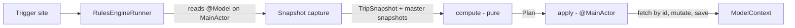

# Design: Phase 2 Rules Engine

## Overview

Phase 2 adds a deterministic rules engine and the Master Lists editor surface to consume it. The engine is a value-type capture / pure compute / `ModelContext` apply pipeline; the editor is a SwiftUI flow under `Features/MasterLists/` that follows the same draft + validate + persistence-helper pattern Phase 1 established for `Trip`.

## Architecture

### Module layout

```
Scramble/Scramble/
├── RulesEngine/                          NEW
│   ├── Snapshots.swift                   value types + factories
│   ├── Plan.swift                        Plan + TripItemRef
│   ├── Compute.swift                     pure compute(...)
│   ├── Apply.swift                       @MainActor apply(plan:context:)
│   └── RulesEngineRunner.swift           snapshot+compute+apply orchestration
├── Models/Codable/ItemConditions.swift           UNCHANGED — owns the pure evaluate(against:)
├── Features/
│   ├── MasterLists/
│   │   ├── MasterListsTab.swift                   MUTATED — host segmented control + child lists
│   │   ├── MasterTasksList.swift                  NEW — @Query grouped by Phase
│   │   ├── MasterPackingList.swift                NEW — @Query grouped by Person
│   │   ├── MasterTaskEditor.swift                 NEW
│   │   ├── MasterPackingEditor.swift              NEW
│   │   ├── MasterPersistence.swift                NEW — mirror of TripPersistence
│   │   ├── MasterTaskDraft.swift                  NEW
│   │   ├── MasterPackingDraft.swift               NEW
│   │   ├── ConditionsEditor.swift                 NEW — chip-multiselect editor
│   │   ├── AttributeSelections.swift              NEW — ↔ ItemConditions bridge
│   │   ├── AdvancedConditionView.swift            NEW — read-only placeholder + reset
│   │   └── ItemConditions+PrettyPrint.swift       NEW — prettyPrinted(indent:)
│   ├── Trips/TripListView.swift                   MUTATED — runner.runForTrip in onSave (create)
│   ├── Trips/TripDetailView.swift                 MUTATED — runner.runForTrip in onSave (edit sheet); + debug inspection identifier for ColdLaunchSequencingUITests
│   ├── Trips/TripEditorView.swift                 UNCHANGED — the editor passes drafts to its `onSave` closure; the runner call lives in the parent's closure, not here
│   ├── Trips/TripsTab.swift                       UNCHANGED
│   └── Root/RootView.swift                        MUTATED — scenePhase trigger only (cold-launch moved to ScrambleApp.init)
└── ScrambleApp.swift                              MUTATED — cold-launch scan in init() after UITestSeed
```

No new SwiftData entities. No schema migration. AC 8.2 is satisfied by Phase 1's existing `PersonDeleteBlocker` (see Person deletion guard) — no Phase 2 change to that file.

### Snapshot / compute / apply pipeline



The boundary `compute(...)` lives at is intentional: every input is a value type and every output is a value type. Tests instantiate `TripSnapshot` and master snapshots directly; no `ModelContainer` is needed for the engine's bulk coverage. Snapshot capture and apply are the only steps that hold `@Model` references, both on the `MainActor`.

### Trigger integration points

| AC | Trigger | Site | Hook |
|---|---|---|---|
| 5.1 | Trip created | `TripListView` `onSave` closure for the create sheet (currently calls `TripPersistence.create` then `try modelContext.save()` then `return true`) | Insert `runner.runForTrip(newTrip)` between `modelContext.save()` and `return true`. Caller catches `RulesEngineRunner` throw, surfaces toast via the existing transient-toast path used by orphan-participants. |
| 5.2 | Trip attributes saved | `TripDetailView`'s edit sheet (TripDetailView.swift line 79, `.sheet { TripEditorView(mode: .edit(trip), …) { draft in … } }`) | Same: after `TripPersistence.apply(...)` + `modelContext.save()`, call `runner.runForTrip(trip)` before the closure returns. |
| 5.3 | Master item saved/deleted | `MasterTaskEditor.onSave`, `MasterTaskEditor.onDelete`, `MasterPackingEditor.onSave`, `MasterPackingEditor.onDelete` | Editor closure ordering: (1) call `MasterPersistence.{create,apply,delete}*`, (2) `try modelContext.save()`, (3) `try runner.runForAllNonPastTrips()`. The runner call lives in the editor closure, not inside `MasterPersistence`. |
| 5.4 | Cold launch | `ScrambleApp.init()` after `UITestSeed.applyIfRequested(...)` | See Cold-launch mechanism below. |
| 5.7 | Foreground transition | `RootView.onChange(of: scenePhase)` | Fires only on `.background → .active`, not `nil → .inactive → .active`. |

The trigger ordering invariant is: **mutate → save → run engine**. Reversing save and engine would have the engine read a stale store (master not yet persisted) and miss its own input. The editor closures own the sequence; `MasterPersistence` and `TripPersistence` deliberately do not call `context.save()` themselves so the trigger sites stay in control.

### Cold-launch mechanism (AC 5.4)

The scan runs inside `ScrambleApp.init()`, immediately after the existing `UITestSeed.applyIfRequested(to: ModelStore.shared)` line. `ScrambleApp.init()` is `@MainActor`-isolated under Swift 6's MainActor-default mode (matching Phase 1's pattern), so `ModelStore.shared` access and the runner call are direct synchronous main-actor calls:

```swift
@main
struct ScrambleApp: App {
    init() {
        #if DEBUG
        UITestSeed.applyIfRequested(to: ModelStore.shared)
        #endif
        // AC 5.4: cold-launch scan. Runs before WindowGroup mounts any view,
        // so TripsTab's auto-open task is guaranteed to observe post-scan state.
        try? RulesEngineRunner(context: ModelStore.shared.mainContext)
            .runForAllNonPastTrips()
    }
    var body: some Scene { /* unchanged */ }
}
```

This sidesteps SwiftUI's unspecified `.task` sibling-ordering: the scan is structurally complete before the view tree exists. Errors are intentionally swallowed (`try?`) and `os_log`'d inside the runner — there is no UI to display them against at this point. The Phase 1 `TripsTab` auto-open invariant (Phase 1 AC 5.6) is preserved: `TripsTab.task` runs against a store the scan has already touched.

Tests cover this mechanically — `ColdLaunchSequencingUITests` (see Testing Strategy) seeds a master+trip pair where the engine must flag, cold-launches, and asserts the auto-opened Trip Detail observes the post-scan state.

### scenePhase carve-out (AC 5.7)

```swift
@Environment(\.scenePhase) private var scenePhase
@State private var previousScenePhase: ScenePhase? = nil

.onChange(of: scenePhase) { _, newPhase in
    defer { previousScenePhase = newPhase }
    guard previousScenePhase == .background, newPhase == .active else { return }
    runner.runForAllNonPastTrips()
}
```

The `previousScenePhase == .background` guard is what enforces "not on cold launch" — the first transition the system delivers is `nil → .inactive → .active`, so `previousScenePhase` is never `.background` at that moment. Idempotency (AC 5.6) protects against any unexpected sequence the system might deliver.

## Components and Interfaces

### Rules engine

```swift
// Snapshots.swift
struct TripSnapshot: Equatable, Sendable {
    let id: UUID
    let attributes: TripAttributes
    let existingTasks: [TripTaskRef]
    let existingPacking: [TripPackingItemRef]
}

struct TripTaskRef: Equatable, Hashable, Sendable {
    let id: UUID
    let masterItemID: UUID?
    let currentlyMatchesRules: Bool
    let pinnedByUser: Bool
    let source: ItemSource
    let isCompleted: Bool
}

struct TripPackingItemRef: Equatable, Hashable, Sendable {
    let id: UUID
    let masterItemID: UUID?
    let currentlyMatchesRules: Bool
    let pinnedByUser: Bool
    let source: ItemSource
    let state: PackingState
}

struct MasterTaskSnapshot: Equatable, Hashable, Sendable {
    let id: UUID
    let name: String
    let phase: Phase
    let conditions: ItemConditions
}

struct MasterPackingSnapshot: Equatable, Hashable, Sendable {
    let id: UUID
    let name: String
    let personID: UUID
    let conditions: ItemConditions
}
// `MasterPackingItem.person` is optional in the schema (CloudKit constraint),
// but a master with `person == nil` is a degenerate state — there is no
// observable user flow that produces it. Snapshot capture skips such masters
// and logs `[RulesEngine.skip-orphan-master]`. `personID` is therefore
// non-optional in the snapshot.

// Plan.swift
struct TripItemRef: Equatable, Hashable, Sendable {
    enum Kind: String, Sendable { case task, packing }
    let kind: Kind
    let id: UUID
}

struct Plan: Equatable, Sendable {
    let tripID: UUID
    let toAddTasks: [MasterTaskSnapshot]      // sorted by id asc
    let toAddPacking: [MasterPackingSnapshot] // sorted by id asc
    let toFlagUnmatched: [TripItemRef]        // sorted by (kind, id) asc
    let toFlagMatched: [TripItemRef]          // sorted by (kind, id) asc
    var isEmpty: Bool { /* all four collections empty */ }
}

// Compute.swift
func compute(
    trip: TripSnapshot,
    masterTasks: [MasterTaskSnapshot],
    masterPacking: [MasterPackingSnapshot]
) -> Plan
```

`compute` algorithm:
1. Build `[UUID: MasterTaskSnapshot]` and `[UUID: MasterPackingSnapshot]` lookup maps from the input arrays. Without this, step 3's per-ref lookup is O(n) and the 500-items × 200-masters worst case blows the budget.
2. Build a `Set<UUID>` of master ids already referenced on the trip (union over `existingTasks.masterItemID` and `existingPacking.masterItemID`, ignoring nils). This handles AC 6.4 dedup in one pass — including duplicate refs from sync races, which are tolerated as a single "present" entry.
3. For each master snapshot, evaluate `conditions` against `trip.attributes`. If true and the master id is not in the referenced-id set, emit to `toAddTasks` / `toAddPacking`.
4. For each existing ref with non-nil `masterItemID`, classify per the **4-way decision matrix** below. The matrix is the single source of truth for compute's flag emissions:

   | `currentlyMatchesRules` | master conditions evaluate | Action |
   |---|---|---|
   | `true` | `true` | **no-op** — emit nothing (compute-level enforcement of AC 4.5's no-CloudKit-push) |
   | `true` | `false` | `toFlagUnmatched` (subject to exclusion table below) |
   | `false` | `true` | `toFlagMatched` (NO exclusions — AC 6.1 final sentence) |
   | `false` | `false` | **no-op** |

   Apply these classifications subject to these pre-filters:
   - If `source == .manual`, skip (AC 4.6 — manual items are invisible to the engine; `currentlyMatchesRules` is semantically undefined for them).
   - If master not found in step-1 lookup map (master deleted), treat its conditions as evaluating false (AC 4.7).
5. Sort each collection by id ascending (`toFlag*` sorted by `(kind, id)`). Construct `Plan`.

Edge case: `.match(attribute:, anyOf: [])` evaluates `false` (an empty `anyOf` never matches anything). The chip editor cannot produce this shape, but a corrupt blob or future external source could. Documented at the top of `Compute.swift`.

**Exclusion table — read this carefully, the asymmetry is load-bearing.** Pin, completion, and engagement state protect items from being *demoted* (`toFlagUnmatched`) but never from being *re-matched* (`toFlagMatched`):

| Trip-level item attribute | Excludes from `toFlagUnmatched`? | Excludes from `toFlagMatched`? |
|---|---|---|
| `pinnedByUser == true` | Yes (AC 6.1) | No (AC 6.1 last sentence) |
| `isCompleted == true` (tasks) | Yes (AC 6.2) | No |
| `state ∈ {.packed, .repacked, .excluded}` (packing) | Yes (AC 6.3) | No |
| `source == .manual` | Yes (AC 4.6) | Yes (AC 4.6 — engine ignores manual items entirely) |
| dangling `masterItemID` (master deleted) | Subject to AC 6.1–6.3 (AC 6.5) | N/A — missing master evaluates false |

Concrete edge cases the table resolves:
- A pinned task whose master conditions evaluate true AND `currentlyMatchesRules == false` → `toFlagMatched` (pin does not block re-matching).
- A completed task whose master conditions evaluate true AND `currentlyMatchesRules == false` → `toFlagMatched`.
- A packed item whose conditions match again → `toFlagMatched`.
- A pinned task whose master conditions evaluate false AND `currentlyMatchesRules == true` → no flag change (pin protects).

`ComputeTests` has one row per cell in the table plus one row per concrete edge case.

```swift
// Apply.swift
@MainActor
func apply(plan: Plan, context: ModelContext) throws

// RulesEngineRunner.swift
@MainActor
struct RulesEngineRunner {
    let context: ModelContext

    @discardableResult
    func runForTrip(_ trip: Trip) throws -> Plan

    @discardableResult
    func runForAllNonPastTrips(today: Date = .now, calendar: Calendar = .current) throws -> [Plan]

    // returns Plan(s) for testability / diagnostics; production callers ignore.
}
```

`runForAllNonPastTrips` accepts `today` and `calendar` parameters to match Phase 1's `singleQualifyingTrip(in:today:calendar:)` (TripsTab.swift). The "non-past" predicate is `calendar.startOfDay(for: trip.endDate) >= calendar.startOfDay(for: today)` — calendar-day granularity per AC 5.3. The predicate is evaluated once at the top of the function; every per-trip snapshot uses the same "today" so trips can't appear and disappear mid-loop.

Per-trip error handling inside `runForAllNonPastTrips`: each trip is wrapped in `do/catch` so a single trip's apply failure (corrupt blob, save-conflict) logs and the loop proceeds to the next trip. The aggregate `[Plan]` return contains entries for trips that succeeded; failed trips are absent. This matches the error-handling table's "5.3 / 5.4 / 5.7 log and continue" promise — without per-trip catch, one bad trip would abort the fan-out.

`apply` algorithm:
1. **Short-circuit on empty plan.** If `plan.isEmpty`, return without fetching or saving. This avoids CloudKit churn from idempotent runs that mutate nothing.
2. Fetch `Trip` by `plan.tripID`. If missing (cross-device race), log + return; nothing to apply.
3. For each `MasterTaskSnapshot` in `toAddTasks`: construct `TripTask(name: snap.name, phase: snap.phase, masterItemID: snap.id, source: .rule, currentlyMatchesRules: true, pinnedByUser: false, isCompleted: false)`, assign `task.trip = trip`, `context.insert(task)`.
4. For each `MasterPackingSnapshot` in `toAddPacking`: fetch `Person` by `personID`. If missing → log + skip (AC 4.4). Otherwise construct `TripPackingItem` mirroring step 3, set `person`, assign `item.trip = trip`, `context.insert(item)`.
5. For each `TripItemRef` in `toFlagUnmatched`: fetch `TripTask` or `TripPackingItem` by id (by `kind`). If missing → log + skip. Otherwise set `currentlyMatchesRules = false`.
6. Same for `toFlagMatched` → `true`.
7. `try context.save()`.

`compute` itself does NOT short-circuit "items already matching, currently true" into any output collection — they are simply absent from all three flag collections (AC 4.5 final sentence). The step-1 short-circuit above is what makes the no-op path skip `save()`.

The fetch-by-id step is "fetch by id, tolerate missing." Implementer choice: one batched `FetchDescriptor` per kind with `#Predicate { ids.contains($0.id) }`, OR per-id fetches, OR fetch-by-trip-and-filter-in-memory. `#Predicate` with captured `[UUID]` is the preferred path (Phase 1 `TripPersistence.resolveParticipants` uses the same pattern), but if SwiftData rejects the predicate in some iOS 26 sub-release, fall back to per-id fetches — the contract is "for each id in the plan, find or skip+log."

### Master list UI

`MasterListsTab.swift` becomes a thin host:

```swift
@MainActor struct MasterListsTab: View {
    enum Segment: Hashable { case packing, tasks }
    @State private var segment: Segment = .packing

    var body: some View {
        NavigationStack {
            VStack {
                Picker(...)
                switch segment {
                case .packing: MasterPackingList()
                case .tasks: MasterTasksList()
                }
            }
        }
    }
}
```

`MasterTasksList.swift`:

```swift
@MainActor struct MasterTasksList: View {
    @Query(sort: \MasterTaskItem.name) private var allTasks: [MasterTaskItem]
    @State private var editing: EditTarget? = nil
    enum EditTarget: Hashable { case create, edit(MasterTaskItem.ID) }
    // body: sections per Phase (Phase.allCases order; empty groups omitted),
    // each row → opens MasterTaskEditor as a sheet via .sheet(item:)
}
```

Phase-grouping happens in-memory after fetch: `Dictionary(grouping: allTasks, by: \.phase)` then iterate `Phase.allCases` skipping empty groups (AC 1.1). The fetch is unfiltered because the dataset is small (≤200 master items per AC 5.5) and the grouping is a one-pass map.

`MasterPackingList.swift` mirrors the structure but groups by `Person`, sorted by `Person.name` ascending (AC 2.1). Group header shows person name + item count.

**Empty state for AC 2.7.** When `@Query private var people: [Person]` is empty, `MasterPackingList` renders a `ContentUnavailableView` titled "No people yet" with description "Add a person to a trip first, then return here to define their packing items." The "+ Add item" affordance is hidden in this state. If `people` is non-empty but every person has zero `masterPackingItems`, the list renders the "+ Add item" affordance and per-person sections are simply absent (the existing AC 2.1 grouping omits empty people). The dual empty state ("people exist, no items") and AC 2.7's empty state ("no people") are visually distinct.

### Master item editors

```swift
@MainActor struct MasterTaskEditor: View {
    let mode: Mode             // .create | .edit(MasterTaskItem)
    @State private var draft: MasterTaskDraft
    @State private var validation: [MasterTaskDraft.Field: String] = [:]
    @Environment(\.modelContext) private var context
    @Environment(\.dismiss) private var dismiss
    // body: Form with name, phase Picker, ConditionsEditor or AdvancedConditionView
}

struct MasterTaskDraft {
    var name: String
    var phase: Phase
    var conditions: ItemConditions
    enum Field { case name }
    func validate() -> [Field: String]  // name empty → error
}
```

`MasterPackingEditor` is structurally identical but picks `Person` and validates two fields (`name`, `person`). Both editors hand off to `MasterPersistence` (one helper, two methods per kind):

```swift
@MainActor enum MasterPersistence {
    static func createTask(from: MasterTaskDraft, in: ModelContext) -> MasterTaskItem
    static func applyTask(_: MasterTaskDraft, to: MasterTaskItem, in: ModelContext)
    static func deleteTask(_: MasterTaskItem, in: ModelContext)
    // same trio for packing — no save inside these helpers; the editor closure saves
}
```

`MasterPersistence` does not call `context.save()` — the master editor closure does, between the persistence call and the runner call. Person-deletion blocking is unchanged from Phase 1 (see Person deletion guard).

Master deletion (AC 1.6 / 2.6) does NOT cascade — the trip-level items keep their snapshot per Phase 1's schema (Phase 1 design line 372 "Deleting a MasterPackingItem or MasterTaskItem SHALL NOT cascade"). The engine's next re-eval flags the orphans per AC 4.7.

### Conditions editor

```swift
@MainActor struct ConditionsEditor: View {
    @Binding var selections: AttributeSelections
    // body: ForEach(TripAttribute.allCases) { row of chips }
}

struct AttributeSelections: Equatable {
    var byAttribute: [TripAttribute: Set<String>]
    static let empty = AttributeSelections(byAttribute: [:])

    func toConditions() -> ItemConditions
    static func from(_ conditions: ItemConditions) -> AttributeSelections?  // nil = advanced shape
    func isInDomain() -> Bool  // AC 3.8 defensive check; chip editor never violates this
}
```

`AttributeSelections.from(_:)` returns nil when:
- `conditions` is `.any` at the top level.
- Any child of a top-level `.all` is not `.match`.
- A `.match`'s `anyOf` contains a value outside `TripAttributeOptions.values(for: attr)`.

For `conditions == .always`, `from(_:)` returns a non-nil `AttributeSelections` with every entry empty (the all-zero state). This is the contract the AC 3.7c reset path relies on: after writing `.always`, the editor re-derives selections, finds them non-nil, and re-renders `ConditionsEditor` instead of `AdvancedConditionView`.

`toConditions()` (the inverse) iterates `TripAttribute.allCases` in declaration order (AC 3.5), emits a `.match` per attribute with non-empty selections (values sorted alphabetically for stable encoding), wraps in `.all(...)` unless empty (`.always` per AC 3.4).

**AC 3.8 (domain validation).** The chip editor cannot produce out-of-domain values because chips ARE the value domain — selecting a chip can only add a member of `TripAttributeOptions.values(for: attr)`. AC 3.8 is therefore a defensive guard against external sources (a future cross-version CloudKit sync, or a hand-edited blob). `AttributeSelections.from(_:)` already redirects out-of-domain stored conditions into `AdvancedConditionView` per AC 3.7, so the in-app round-trip is closed. No `Field.conditions` case is added to the draft validators; if a future code path *could* produce out-of-domain selections, that path must call `AttributeSelections.validate() -> Bool` (a defensive helper that returns false for any out-of-domain values) and surface its own error.

**Chip layout.** Uses `LazyVGrid(columns: [GridItem(.adaptive(minimum: 88), spacing: 8)], spacing: 8)`. This wraps cleanly across iPhone widths with Dynamic Type up to AX2. Selected chips fill with the theme accent at full opacity; unselected chips use a 1pt `surfaceBorder` outline filled with `surface`. Phase 1's `TripEditorView` attribute pickers use `Picker(.menu)` / button rows rather than chips, so there is no Phase 1 chip styling to reuse — `ConditionsEditor` introduces the chip control fresh, scoped to Phase 2. Trip editor migration to chips is out of scope.

### Advanced condition placeholder (AC 3.7)

```swift
// New file: Features/MasterLists/AdvancedConditionView.swift
@MainActor struct AdvancedConditionView: View {
    let conditions: ItemConditions
    let onReset: () -> Void
    @State private var confirmingReset = false
    // body: ContentUnavailableView-style block with prettyPrinted text + "Reset to simple" button
}

// New file: Features/MasterLists/ItemConditions+PrettyPrint.swift
// (Kept out of Models/Codable/ so the model file stays CloudKit-pure.)
extension ItemConditions {
    /// Multi-line textual rendering. Used by AdvancedConditionView only.
    func prettyPrinted(indent: Int = 0) -> String
}
```

`prettyPrinted` is a recursive pretty-printer using `attributeValueDisplay` for value formatting. Output example for `.all([.match(.weather, ["rain", "cold"]), .match(.scope, ["international"])])`:

```
all of:
  weather is Rain or Cold
  scope is International
```

The reset confirmation copy paraphrases AC 3.7c verbatim: "Reset conditions to empty? On the next re-evaluation this item will match every non-past trip until you save new conditions." On confirm, the editor sets `draft.conditions = .always` and `selections = AttributeSelections.empty`; the view switches from `AdvancedConditionView` to `ConditionsEditor` automatically because `AttributeSelections.from(.always)` returns `AttributeSelections.empty` (non-nil).

### Person deletion guard (AC 8.2)

Phase 1 already satisfies AC 8.2. `PersonDeleteBlocker.make(for:tripPacking:masterPacking:)` (`Scramble/Scramble/Features/People/PersonDeleteBlocker.swift`) already accepts both `tripPacking: [TripPackingItem]` and `masterPacking: [MasterPackingItem]` and produces a `PersonDeleteBlocker.message` that names both reference kinds. The call site in `TripEditorView.requestDelete` (TripEditorView.swift:293) already passes `person.masterPackingItems` to it.

Phase 2's contribution to AC 8.2 is therefore **zero new code, one new test** (`PersonDeletionGuardUITests`) that proves the existing helper surfaces master-list references created via Phase 2's master-packing editor. The module-layout diagram is corrected: the `TripEditorView.swift` `MUTATED` annotation refers only to the rules-engine trigger hook (`runner.runForTrip(...)`), not to a guard change.

**Master Lists tab does not surface a person-delete affordance.** Phase 2 deliberately does not add a "manage people" surface inside Master Lists; person CRUD remains where Phase 1 placed it (inline create from the trip editor). AC 2.7's empty state directs the user there explicitly.

## Data Models

No new persisted entities. New value types are listed in [Components and Interfaces — Rules engine](#rules-engine). Internal mutations during apply are confined to existing entities:

| Entity | Mutated by Phase 2 | Notes |
|---|---|---|
| `TripTask` | `currentlyMatchesRules` only (5.5), plus full construction on insert (4.3) | Existing items: only the flag changes; engagement state preserved. |
| `TripPackingItem` | `currentlyMatchesRules` only (5.5), plus full construction on insert (4.4) | Same. |
| `Trip` | Untouched. No `lastEvaluatedAt` timestamp persisted (Plan is the diagnostic surface). |
| `MasterTaskItem`, `MasterPackingItem` | Full CRUD via master editors (1.x, 2.x) | Codable bridges already in place from Phase 1. |
| `Person` | Untouched except for the deletion-guard pre-check. |

## Error Handling

| Failure | Response |
|---|---|
| Snapshot capture: TripAttributes / ItemConditions decode failure | Phase 1 Codable bridge already logs + falls back to defaults (`.init()` / `.always`). Snapshot inherits that behavior; engine sees the fallback value. |
| `apply`: `Trip` missing (cross-device delete race) | `os_log(.info)` with `[RulesEngine.skip-trip]` marker. Skip the plan; return without throwing. |
| `apply`: `Person` missing for a new `TripPackingItem` (AC 4.4) | `os_log(.info)` with `[RulesEngine.skip-packing-orphan]`. Skip the insert; continue with the rest of the plan. |
| `apply`: `TripTask` / `TripPackingItem` missing for a flag update | `os_log(.info)` with `[RulesEngine.skip-flag-orphan]`. Skip; continue. |
| `apply`: `context.save()` throws | `os_log(.error)` with `[RulesEngine.save-failed]`. Propagate to caller; trigger sites at 5.1 / 5.2 surface a transient toast (same pattern as orphan-participants in `TripPersistence`); 5.3 / 5.4 / 5.7 log and continue. |
| Master editor: `context.save()` throws on master CRUD | `os_log(.error)` with `[MasterPersistence.save-failed]`. Propagate; editor keeps the draft in memory and surfaces a transient toast using the same pattern as `TripPersistence`'s orphan-participants flow. User can retry save without losing their edits. |
| Master CRUD succeeded but subsequent `runner.runForAllNonPastTrips()` throws | The user's master mutation is durable (already saved). Editor dismisses normally and surfaces a transient toast: "Saved. Some trips couldn't be updated — they'll sync on next launch." Trigger 5.7's next firing or AC 5.4's next cold-launch will re-attempt. |
| Conditions editor: `AttributeSelections.from(...)` returns nil | Editor renders `AdvancedConditionView` instead of `ConditionsEditor`. Name / phase / person editing remains available. |
| Conditions editor: domain validation fails on save (AC 3.8) | Block save, surface inline validation under the relevant attribute row. (Reachable only if `TripAttributeOptions.values(for:)` is later trimmed.) |

`os_log` markers follow the Phase 1 `[ModelStore.fallback]` convention so Console.app filtering stays consistent.

## Testing Strategy

### Unit tests (no `ModelContainer`)

| Suite | Coverage |
|---|---|
| `ComputeTests` | Table-driven over `compute(...)`: `.always` always added, condition-match adds, condition-miss flags, dedup skips re-adds, pin / completed / packed-state exclusions per AC 6.1–6.3, `.excluded` exclusion per AC 6.3, dangling-master flagged unmatched (AC 4.7), `toFlagMatched` does not honour pin/completion (AC 6.1 final sentence). Each row asserts the exact `Plan` returned. |
| `PlanOrderingTests` | `Plan` collections sorted by id ascending for `toAdd*` and `(kind, id)` for `toFlag*` (AC 4.9). Snapshot stability across re-runs. |
| `AttributeSelectionsTests` | `from(_:) → toConditions()` round-trip for v1 shapes (AC 3.6); returns nil for nested `.all` / `.any`, top-level `.any`, out-of-domain `anyOf` (AC 3.7); `toConditions()` produces deterministic key ordering. |
| `MasterDraftTests` | `validate()` for empty name (task + packing), missing person (packing). |
| `ConditionsPrettyPrintTests` | Output strings for representative trees; ZWJ-joined emoji in attribute values do not crash (defense). |

### Integration tests (in-memory `ModelContainer`)

| Suite | Coverage |
|---|---|
| `RulesEngineApplyTests` | `apply` writes correct fields, no-op when already-true items pass through (AC 4.5 final sentence — assert via SwiftData has-changes inspection), missing-trip / missing-person / missing-trip-item all log + skip + don't throw, save round-trip. |
| `RulesEngineRunnerTests` | End-to-end runner: capture from a real `Trip`, compute, apply, second invocation produces empty `Plan` (AC 5.6 idempotency). Cold-launch path (`runForAllNonPastTrips`) covers ≤3 trips, asserts only non-past trips are touched. |
| `MasterPersistenceTests` | Create / edit / delete master task and packing item; person-deletion blocker count includes both `tripPackingItems` and `masterPackingItems`. Trip-level items referencing a deleted master are NOT cascade-removed and retain `name` / `masterItemID` (AC 1.6 / 2.6 / 4.7 / 6.5). |

### UI tests (`ScrambleUITests`)

| Test | Coverage |
|---|---|
| `MasterListsCRUDUITests` | Create master task → see in Tasks segment grouped by phase. Create master packing item → see in Packing segment grouped by person. Edit a master → save → row updates. Delete a master → confirm → row disappears. |
| `ConditionsEditorUITests` | Open editor, select weather chips (rain, cold), select scope chip (international), save, reopen, assert chip selections persisted. Empty save → `.always` round-trips correctly. Domain-mismatched fixture → `AdvancedConditionView` shown with "Reset to simple" affordance. Reset → confirms → editor returns to chip view. |
| `RulesEnginePopulationUITests` | Seed via debug launch arg: a `MasterPackingItem` "Rain jacket" with `weather: rain`, a `Person`, no trip. Create trip via editor with `weather: rain`. After save, the trip's `packingItems` collection contains "Rain jacket" with `currentlyMatchesRules = true` (asserted via debug-only inspection identifier on `TripDetailView`). |
| `ColdLaunchSequencingUITests` | Seed: one qualifying trip (auto-open per Phase 1 AC 5.6) AND a master item whose conditions newly match that trip. Cold launch. Assert the auto-opened Trip Detail screen renders with the rule-driven item already attached — proves the cold-launch engine scan (AC 5.4) completes before the auto-open task fires. This pins the ordering invariant the design relies on. |
| `PersonDeletionGuardUITests` | Person owning a `MasterPackingItem` cannot be deleted; alert message includes the master-list count. |

### Property-based tests

`Compute` is the strongest PBT candidate. Properties to test using Swift Testing's parameterized inputs:

1. **Idempotence**: For any (`TripSnapshot`, masters), `compute(after-apply(compute(...)))` returns an empty `Plan` (AC 5.6). Apply must be simulated as a value-type rewrite of `TripSnapshot.existingTasks` / `existingPacking` so the second `compute` is pure.
2. **Determinism**: `compute(x, m1, m2) == compute(x, m1, m2)` for any inputs. (Trivial under purity but pins the contract.)
3. **No spurious adds**: For any masters where every master `.evaluate(trip.attributes) == false`, `Plan.toAddTasks.isEmpty && Plan.toAddPacking.isEmpty`.
4. **Pin protection asymmetry (AC 6.1)**: For any snapshot with a pinned, currently-matched item whose master conditions evaluate false, the item is NOT in `toFlagUnmatched`. For the same snapshot with `currentlyMatchesRules = false` and master conditions evaluate true, the item IS in `toFlagMatched`.

Generators: `TripSnapshot` with 0–10 existing items, master arrays of length 0–20, conditions trees bounded to the v1 shape (`.always` or `.all([.match(...), ...])`). The Phase 1 `ItemConditions` round-trip PBT already covers nested shapes; Phase 2 PBT focuses on the diff logic and only needs v1 conditions to exercise the engine.

`apply` is not a PBT target — its contract is per-row deterministic and table-driven coverage suffices.

### Additional test rows pinned by review

- `ComputeTests` row per cell in the exclusion-asymmetry table (5 rows minimum: pin, completion, packed/repacked, excluded, manual + symmetric matched-side cases).
- `ComputeTests` row for snapshot capture's worst case: a trip with zero items + 200 masters where every condition matches → `Plan.toAdd*` totals 200 entries, ids sorted, no overlap.
- `ConditionsEditorUITests` row: edit name/phase while in `AdvancedConditionView` mode (AC 3.7b — conditions disabled but other fields editable).
- `RulesEnginePopulationUITests` row for AC 5.2 edit-mode trigger: open `TripDetailView`, edit attributes to flip a condition, save, assert flag updated.
- `RulesEngineRunnerTests` row for the empty store case (zero non-past trips → `runForAllNonPastTrips` returns `[]`).
- `RulesEngineRunnerTests` row for per-trip catch: 2 trips, the first throws on `apply` (use a corrupt-blob fixture), assert the second is still processed.
- `MasterPersistenceTests` rows for renaming a master and asserting `TripTask.name` / `TripPackingItem.name` are unchanged on existing trip-level items (AC 7.1 — pin direct, not via side-effect).
- `RootViewScenePhaseTests` (XCTest, host-app harness): seed `previousScenePhase = nil`, deliver `.inactive → .active`, assert the runner is not invoked. Then `.active → .background → .active`, assert one invocation.
- `MasterPackingEmptyStateUITests` row for AC 2.7: launch with zero `Person` records, open Master Lists → Packing Items, assert empty-state copy is shown AND "+ Add item" affordance is hidden.
- `MasterPersistenceTests` row for AC 7.2: rename a `MasterTaskItem`'s `phase` from `.weeksBefore` to `.dayBefore`, run the engine, assert existing referencing `TripTask.phase` is unchanged.
- `MasterPersistenceTests` row for AC 7.3: change a `MasterPackingItem`'s `person`, run the engine, assert existing referencing `TripPackingItem.person` is unchanged.
- `SnapshotsTests` row: `MasterPackingItem.person == nil` is skipped during snapshot capture (logs `[RulesEngine.skip-orphan-master]`, does NOT produce a `MasterPackingSnapshot`).
- `ComputeTests` row: `ItemConditions.match(.weather, anyOf: [])` evaluates `false` (defense against corrupt blob).

### What is NOT tested in Phase 2

- Cross-device CloudKit sync convergence — requires real iCloud accounts; out of scope.
- Visual regression on the conditions editor chip layout — deferred until Phase 6 polish.
- AC 5.5's 250ms wall-clock target is NOT enforced by an automated test in Phase 2. CI lacks a stable wall-clock harness, and adding one for a single AC has poor cost/benefit. Implementation phase: take an Instruments trace of the worst-case trigger (AC 5.3 master save with the bounded dataset) and record the wall-clock observation in `implementation.md` or the agent notes. If a future phase introduces a perf-test harness, AC 5.5 graduates to a smoke test with 4× headroom (assert < 1000ms).
